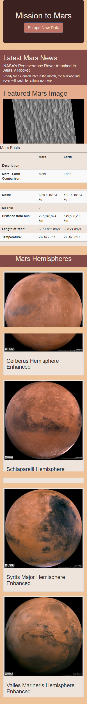

# mission-to-mars

## Overview
To create an app capable of scraping websites for data related to Mars. 

## Initial App Creation
Initial creation of the app was focused on three major things:
1. Scrape the headline and article teaser of a recent Mars-related headline
2. Scrape an image of the surface of Mars for a feature
3. Scrape facts related to Mars and it's environment 
After all relevant information was scraped, an HTML template was created to visually organize the data. In addition, a button was added
to the app to allow for ease of use. This button instructs the app to rescrape all relevant websites to retrieve recent data. 

### Desktop App

### Mobile App

## Addition of Hemisphere Section
Additional code was written to scrape images of Mars' hemispheres from another source site. These images
were displayed in a separate section of the app. 

### Desktop App

### Mobile App

## Stylization
Utilizing Bootstrap3 and the previously created HTML template, the app was stylized to make it more visually appealing. 
Different sections were highlighted in different colors to ensure a pleasant user experience.
In addition, a red-based color palette was used to blend the user interface seamlessly with the red surface of Mars, preventing any
disconcerting color combinations. 

### Desktop App

### Mobile App

